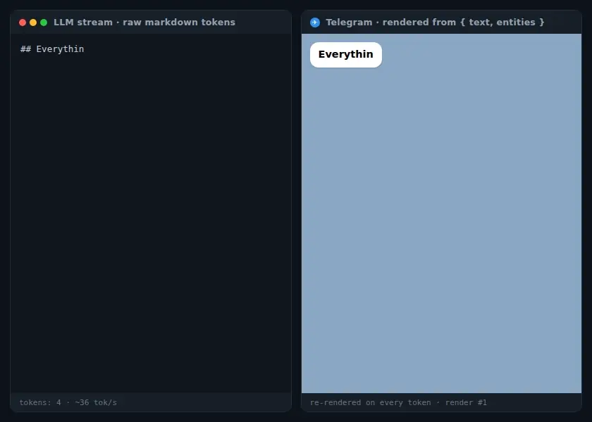

# telegram-md-entities

Lenient markdown → Telegram Bot API `{ text, entities }` renderer, built for LLM output.

**No `parse_mode`. No escaping. No `can't parse entities`. Ever.**

Instead of serializing markdown into a MarkdownV2 string and praying the server-side parser accepts it, this library renders markdown into plain text plus a [`MessageEntity[]`](https://core.telegram.org/bots/api#messageentity) array — structured data with no syntax to break. Battle-tested against the real Bot API: every fixture in the test corpus round-trips byte-exact through `sendMessage`.

```ts
import { renderMarkdown, splitMessage } from 'telegram-md-entities';

const { text, entities } = renderMarkdown(llmOutput);
await bot.api.sendMessage(chatId, text, { entities }); // grammy / telegraf / raw HTTP — same shape
```

<p align="center">
  
</p>

*Raw LLM tokens on the left, the Telegram message on the right, re-rendered with `{ streaming: true }` on **every token**: half-typed `**bold` is already bold, an unclosed ` ``` ` fence is already a live code block with its language header, and the final frame is byte-identical to the strict render. In production, Telegram flood control caps `editMessageText` at roughly one edit per second per chat (≈20/min in groups) — every throttled edit is simply one of these frames, and Telegram clients animate edits, so the stream still feels smooth in the app. (Recorded through the library's own Telegram-calibrated preview renderer — regenerate with `pnpm demo`.)*

## Why entities instead of MarkdownV2 strings

| MarkdownV2 string pipeline | this library |
|---|---|
| 18 characters need escaping; one miss = HTTP 400 | nothing is ever escaped |
| `can't parse entities` needs fallback chains | structurally impossible |
| `` ` `` and `\` inside code blocks still need escaping | code content is passed through verbatim |
| visible length = guesswork through the parser | `text.length` is exact (UTF-16, what Telegram counts) |
| splitting breaks formatting at boundaries | entities close & reopen across chunks seamlessly |
| tables become a wall of `\|` | ASCII tables → aligned `pre` grids; CJK tables → clean record lines |

On this repo's 17-fixture corpus, the popular string pipeline (`telegramify-markdown` + `parse_mode`) produces hard 400 parse errors on 3 fixtures; the entities path has zero failures (`RUN_DIFFERENTIAL=1 pnpm test:e2e` reproduces the report).

## API

```ts
renderMarkdown(markdown, options?)   // → { text, entities }
splitMessage(message, options?)      // → chunks fitting maxLength (4096) AND maxEntities (90)
validateMessage(message)             // → offline Bot API rule check (offsets, nesting, budgets)
toPreviewHtml(message, options?)     // → Telegram-like HTML for offline visual review
wrapInBlockquote(message, expandable?) // e.g. LLM "thinking" sections
concatMessages(...parts)             // compose with automatic entity re-offsetting
entitiesToMarkdown(message)          // REVERSE: {text, entities} -> markdown (this dialect)
richBlocksToMarkdown(blocks, opts?)  // REVERSE: Bot API 10.1+ rich message blocks -> markdown
styleSegments(message)               // per-char style runs: display-equivalence comparator
```

### Streaming mode

```ts
renderMarkdown(buffer, { streaming: true })
```

For token-streaming UIs: unclosed constructs render as their intended formatting instead of literal markers — `**bo` shows as bold, an unclosed ``` fence becomes a live-updating highlighted code block, a half-typed `[label](https://…` shows just the label until the URL completes. On a complete document, streaming output is byte-identical to strict mode, so your final edit is a no-op.

### Markdown coverage

GFM (tables, strikethrough, task lists, autolinks) + `||spoiler||` (loose Telegram-style pairing by default, `|| text ||` works; `spoilerMode: 'strict'` for CommonMark flanking) and `__underline__` dialects (Telegram MarkdownV2 semantics: `__` means underline, bold is `**`; `_italic_` unaffected — opt out with `underline: false`). Headings → bold; `---` → text divider; nested quotes flattened (Telegram quotes can't nest); bare URLs left for client auto-linking.

**`<details>`/`<summary>`** HTML blocks (the collapsible-content pattern LLMs love) become **expandable blockquotes** — Telegram's native equivalent. The summary renders as a bold header line, padded with blank lines so the content sits below the client's ~3-visible-line collapse window: the quote actually folds and the content stays hidden until tapped (clients never collapse short quotes, and even collapsed ones show their first lines — without padding a short "secret" would be fully visible). Works with or without `<summary>`, across blank lines or on a single line; `<br>` inside becomes a newline; markdown inside renders normally; nested/quoted occurrences flatten (Telegram quotes can't nest). In streaming mode half-typed tags stay invisible and an in-progress summary grows live inside the quote.

**Tables** (`table: 'auto'`, the default): narrow-only tables become a monospace-aligned `pre` grid — exact on every client, since mono fonts are actually monospace for ASCII. Tables containing East Asian Wide characters become a nested bullet list instead — `• **first cell**` per row with a `• header: value` sub-item per remaining cell. This is deliberate: inside Telegram `pre` blocks, CJK ideographs, `U+3000` and fullwidth punctuation resolve to *different* fallback fonts with *different* advance widths on each client (measured live on macOS/Android), so no padding scheme can align a mixed grid everywhere — and padded grids overflow phone bubbles and wrap anyway. Force a mode with `table: 'pre' | 'records' | 'plain'`.

**CJK-friendly emphasis** via [micromark-extension-cjk-friendly](https://www.npmjs.com/package/micromark-extension-cjk-friendly): `的**“重点”**后` renders bold — vanilla CommonMark flanking rules silently break emphasis next to fullwidth punctuation, which hits Chinese/Japanese/Korean LLM output constantly. The streaming tail scanner applies the same relaxed rules, so in-progress CJK bold renders correctly mid-stream too.

### Reverse pipeline (entities → markdown)

`entitiesToMarkdown({ text, entities })` converts a received Telegram message back to markdown in this package's own input dialect — overlapping / server-split entities are flattened into per-character style runs and rebuilt as strictly nested markers with close-and-reopen at boundaries. Server auto-detections (`url`, `mention`, `hashtag`, `custom_emoji`, …) pass through as plain text; `text_mention` becomes a `tg://user?id=` link. The acceptance rule is round-trip display equivalence: `renderMarkdown(entitiesToMarkdown(msg))` covers each character with the same styles as the original. Known lossy edges: 3+ consecutive newlines collapse, a paragraph directly after a quote gains a blank line, code is opaque (styles on code characters split around it), and one-way sugar (headings, tables, lists) is never inferred back.

`richBlocksToMarkdown(blocks)` converts Bot API 10.1+ rich messages (`message.rich_message.blocks`, the Premium rich-text editor format) to markdown: headings → `#`, tables → GFM pipes, `details` → `<details>`, pre → fenced code, LaTeX blocks → ```latex fences, embedded media → text placeholders (customizable via `mediaPlaceholder`). Types are structural — pass grammy's `RichBlock[]` straight in.

Both target this dialect on purpose: the forward parser is the referee, so reversibility is mechanically testable.

## Encoded server behavior

Rules discovered and verified against api.telegram.org (see `test/e2e/`):

- entities beyond **exactly 100** per message are silently dropped (measured: 150 sent → 100 kept) — `splitMessage` budgets 90 per chunk
- characters inside `code`/`pre` are not stylable — formatting is split around them up front
- `text_link` with non-`http(s)`/`tg` URLs (e.g. `mailto:`) is silently dropped — such links degrade to plain text
- the server freely splits/merges entities in its canonical form — the e2e suite compares per-character style maps, not raw entity lists

## Testing

- `pnpm test` — offline: unit + snapshots (entities JSON & preview HTML) + fast-check invariants (arbitrary-input safety, split losslessness, streaming convergence & prefix sweeps)
- `pnpm test:e2e` — real round-trips: sends the corpus to a test chat (`TEST_BOT_TOKEN` / `TEST_CHAT_ID` in `.env`), deep-compares the server-normalized entities from the `sendMessage` response; kept messages double as a visual render gallery
- `pnpm test:probe` / `pnpm test:differential` — one-time entity-cap probe & string-pipeline comparison
- `pnpm visual` — headless-chromium screenshot gallery (`test/visual/screenshots/`): every corpus fixture, streaming frame sequences, and split chunks rendered through the Telegram-calibrated preview for eyeball/visual-diff review
- `pnpm playground` — local playground with live preview, split view and a streaming simulator
- `pnpm demo` — regenerates the animated streaming demo at the top of this README

## License

MIT
